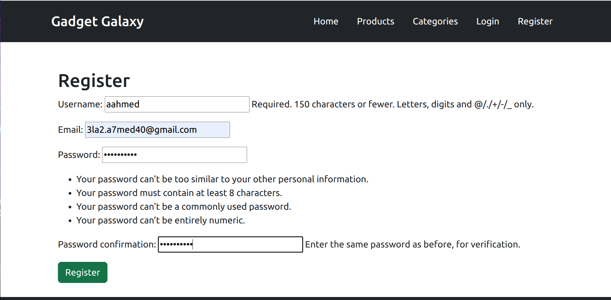
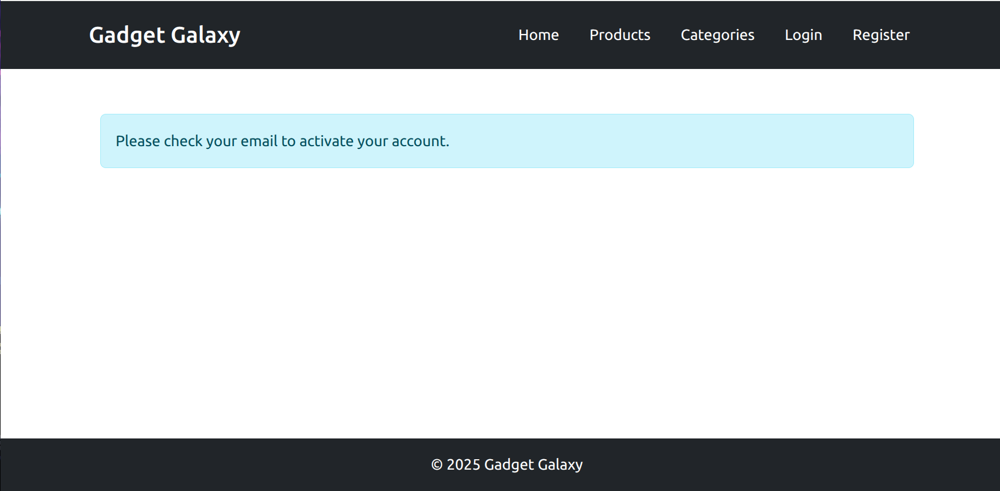
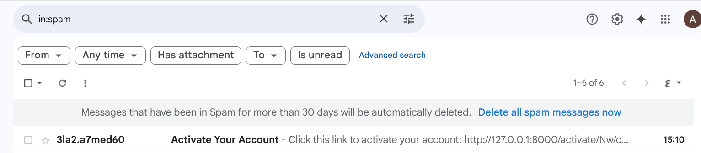
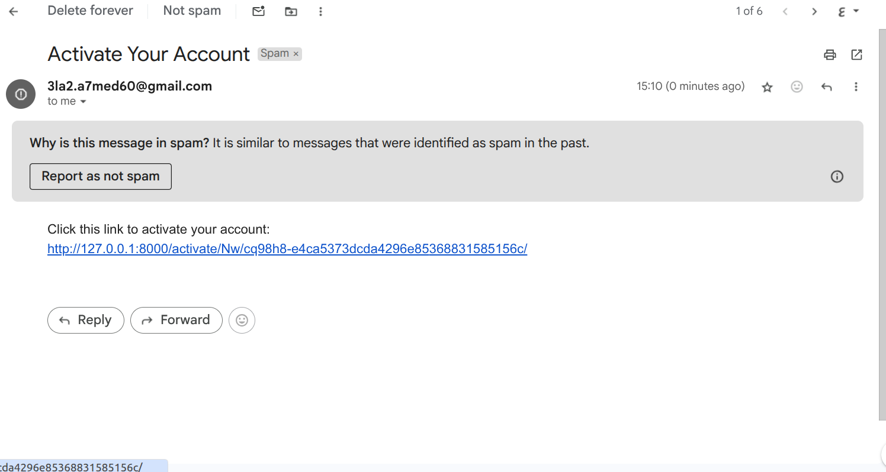
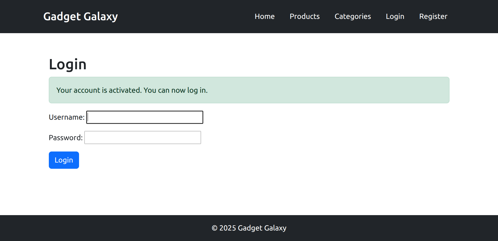
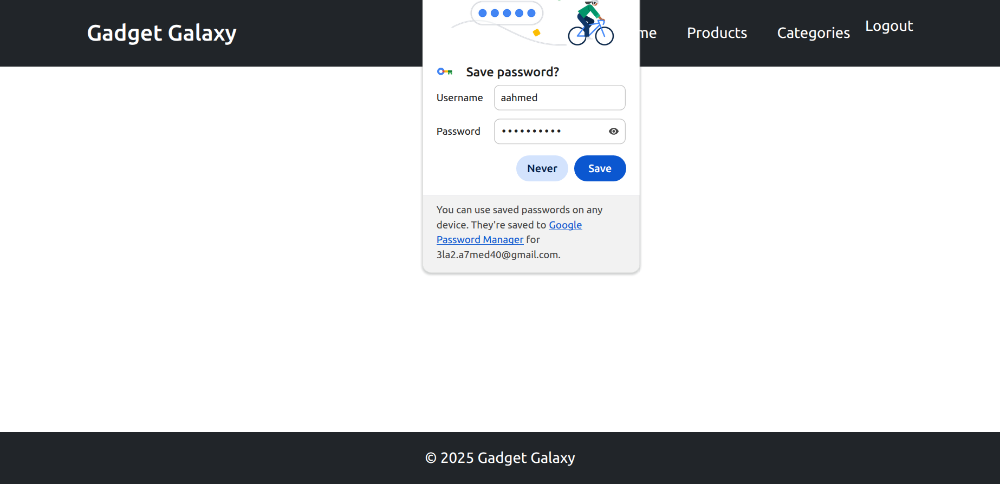
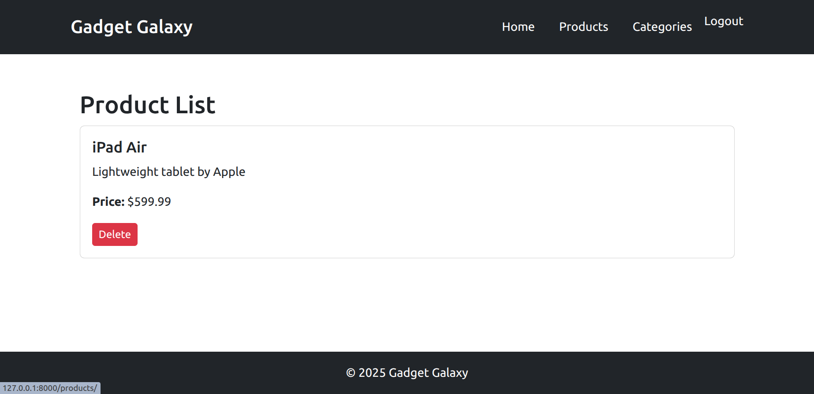
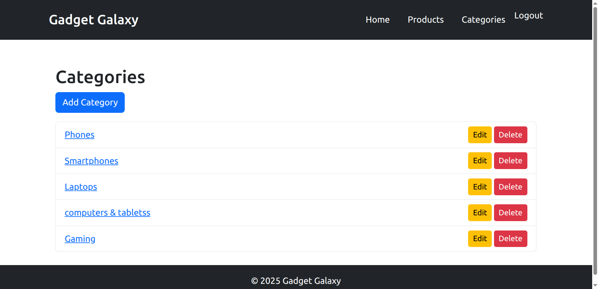

# Gadget Galaxy

Gadget Galaxy is a Django-based web application that provides complete CRUD functionality for product and category management, along with user authentication and email verification using Celery and Redis.

---

## Features

* User registration with email verification
* User login and logout
* Password validation
* Category CRUD using Django class-based generic views
* Product listing, creation, and soft delete
* Celery and Redis for asynchronous email sending
* Responsive Bootstrap design

---

## Screenshots

### Register Page



### Email Verification





### Login Page




### Product List



### Category List



---

## Setup Instructions

### 1. Clone the repository

```bash
git clone git@github.com:aahmed1009/gadget_galaxy-Django.git
cd gadget_galaxy
```

### 2. Create and activate a virtual environment

```bash
python -m venv venv
source venv/bin/activate  # On Windows use `venv\Scripts\activate`
```


### 3. Configure your `.env` or `settings.py`

Update email backend and credentials for Gmail or SMTP service.
```python
# Email Configuration
EMAIL_BACKEND = 'django.core.mail.backends.smtp.EmailBackend'
EMAIL_HOST = 'smtp.gmail.com'
EMAIL_PORT = 587
EMAIL_USE_TLS = True
EMAIL_HOST_USER =  ''  # Set in your .env file
EMAIL_HOST_PASSWORD =''  # App password from Gmail
```

> 📧 If you're using Gmail:
>
> 1. Enable **2-Step Verification**.
> 2. Go to **Google Account > Security > App passwords**.
> 3. Generate a new app password and use it as `EMAIL_HOST_PASSWORD`.
> 4. Store your credentials safely in a `.env` file.
### 5. Setup Redis (required for Celery)

```bash
sudo apt update && sudo apt install redis-server
sudo service redis-server start
```

### 4. Apply migrations

```bash
python manage.py migrate
```

### 5. Start Celery worker

```bash
celery -A gadget_galaxy worker -l info
```

### 6. Run the development server

```bash
python manage.py runserver
```

---

## Project Structure

```
gadget_galaxy/
├── gadget_galaxy/       # Project settings
├── product/             # Product app
├── category/            # Category app
├── user/                # User registration/login
├── templates/           # HTML templates
├── static/              # CSS and JS files
└── README.md            # Project documentation
```

---

## Author

Developed by Alaa - [alaa.ahmedgamal10@gmail.com](mailto:alaa.ahmedgamal10@gmail.com)

